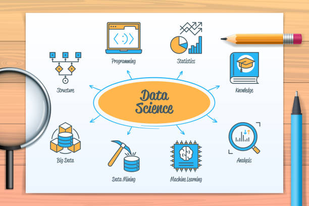

 <!-- 👩🏻 Personal GitHub Profile README for Athira K Nair -->

  

<h2 align="center">Hi 👋, I'm Athira K Nair</h2>

   Aspiring Data Scientist | Passionate about AI, Machine Learning, and Real-world Problem Solving  

---

###  About Me

-  Master’s student with a focus on Data Science & AI
-  Currently exploring: Applied ML, Deep Learning, and AI-powered tools
-  Love building end-to-end data science projects with real impact
-  I value clean code, storytelling through data, and constant learning

---

###  Tools & Tech I Work With

---

###  Featured Project

** [Customer Churn Prediction](https://github.com/athiraknair08/customer-churn-prediction)**  
Predicting customer churn using XGBoost, SMOTE, and hyperparameter tuning.  
 Strong recall on churners (67%)  
 End-to-end workflow with EDA, modeling, feature importance, and Streamlit deployment

---

###  GitHub Stats

  
  

---

###  Let’s Connect

---

>  “Data is the new oil, but storytelling is the spark.”  
> — Athira

